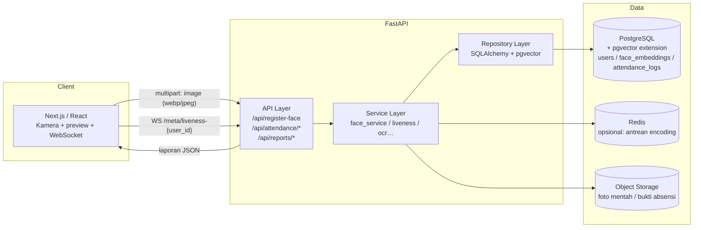

# Face Attendance — Sistem Absensi Berbasis Pengenalan Wajah

Aplikasi absensi karyawan dengan facial recognition (128-d embedding, dlib/face_recognition), anti-spoofing liveness detection, dan dashboard admin. Backend Python FastAPI + PostgreSQL (pgvector), Frontend React/Next.js.

---

## 1. Arsitektur



### Alur Registrasi Wajah

1. User/foto awal diunggah → `face_service.encode(image)` menghasilkan **128-d vector** (dlib `face_recognition`).
2. Normalisasi vektor (uanjang = 1) agar jarak bermakna seragam → simpan ke tabel `face_embeddings`.
3. Verifikasi kualitas: deteksi 1 wajah, ukuran crop ≥ 96×96 px, blur/skew dicek. Data mentah disimpan sebagai bukti audit.

### Alur Absensi Real-Time

1. Kamera menangkap frame → liveness check (blink 2 detik) via endpoint `/api/attendance/liveness`.
2. Foto diambil → `/api/attendance/check-in` → ekstrak embedding → **nearest neighbor** via cosine distance di pgvector (`<=>`).
3. Threshold kesamaan: `cosine_distance <= 0.35` dianggap match (tuning-able per deployment).
4. Jika match → catat log; log tanggal sama + tipe sama (check-in/check-out) → idempotent (409 Conflict).

### Arsitektur Encodings

- **Vector**: 128 dimensi float32, disimpan via PostgreSQL extension **pgvector** sebagai `vector(128)`.
- **Pencarian**: indeks **IVFFlat** (latensi rendah, dataset < 1M wajah) atau HNSW (akurasi tinggi» varian:
  ```sql
  CREATE INDEX ON face_embeddings USING ivfflat (embedding vector_cosine_ops) WITH (lists = 100);
  ```
- **Anti-spoofing**: kombinasi 3 lapis — ① blink detection (EAR, frame & frame™), ② refleksi/glare atau optical-flow kepala, ③ cadence acak (sistem meminta arah gerakan)). Lapisan ① dipakai di kode ini; ②③ bisa ditambah tanpa mengubah skema DB.

---

## 2. Skema Database

```sql
CREATE EXTENSION IF NOT EXISTS vector;

CREATE TABLE users (
    id            BIGSERIAL PRIMARY KEY,
    employee_id  VARCHAR(32) UNIQUE NOT NULL,
    full_name    VARCHAR(120) NOT NULL,
    email        VARCHAR(160) UNIQUE,
    department   VARCHAR(80),
    position     VARCHAR(80),
    status       VARCHAR(20) NOT NULL DEFAULT 'active'
                  CHECK (status IN ('active','inactive','terminated')),
    created_at   TIMESTAMPTZ NOT NULL DEFAULT now(),
    updated_at   TIMESTAMPTZ NOT NULL DEFAULT now()
);

CREATE TABLE face_embeddings (
    id            BIGSERIAL PRIMARY KEY,
    user_id      BIGINT NOT NULL REFERENCES users(id) ON DELETE CASCADE,
    embedding    vector(128) NOT NULL,
    model        VARCHAR(40) NOT NULL DEFAULT 'dlib-face_recognition',
    quality_score FLOAT NOT NULL DEFAULT 1.0,
    is_active   BOOLEAN NOT NULL DEFAULT true,
    source_image TEXT,
    created_at   TIMESTAMPTZ NOT NULL DEFAULT now()

    -- Hanya 1 embedding aktif per user sekaligus:
    -- (multi-embedding diperbolehkan utk variasi pose; kebijakan sinkronisasi di service layer)
);

CREATE INDEX idx_faces_user   ON face_embeddings (user_id);
CREATE INDEX idx_faces_active  ON face_embeddings (is_active) WHERE is_active;
CREATE INDEX idx_faces_vec_hnsw ON face_embeddings
    USING hnsw (embedding vector_cosine_ops);

CREATE TABLE attendance_logs (
    id            BIGSERIAL PRIMARY KEY,
    user_id      BIGINT NOT NULL REFERENCES users(id) ON DELETE RESTRICT,
    check_type   VARCHAR(10) NOT NULL CHECK (check_type IN ('check-in','check-out')),
    check_time   TIMESTAMPTZ NOT NULL DEFAULT now(),
    confidence    FLOAT NOT NULL, -- cosine_distance saat match
    match_embedding_id BIGINT REFERENCES face_embeddings(id) ON DELETE SET NULL,
    source_image TEXT,
    liveness_passed BOOLEAN NOT NULL DEFAULT true,
    created_at   TIMESTAMPTZ NOT NULL DEFAULT now(),

    UNIQUE (user_id, check_type, (check_time::date))
);

CREATE INDEX idx_attendance_user_time
    ON attendance_logs (user_id, check_time DESC);
CREATE INDEX idx_attendance_date
    ON attendance_logs (check_time DESC);
```

Catatan: kolom `source_image` menyimpan path/URL di object storage — bukan data biner di DB. `REPLICA IDENTITY` default cukup untuk CDC sederhana.

---

## 3. Struktur Direktori Proyek

```
.
├── backend/
│   ├── app/
│   │   ├── main.py               # bootstrap FastAPI, CORS, router
│   │   ├── core/                 # config (.env), keamanan
│   │   ├── models/               # SQLAlchemy models (users, faces, logs)
│   │   ├── schemas/             # Pydantic DTO
│   │   ├── services/
│   │   │   ├── face_service.py  # ekstraksi embedding 128-d
│   │   │   └── liveness.py      # blink detection (EAR)
│   │   └── routers/
│   │       ├── register.py        # POST /api/register-face
│   │       ├── attendance.py     # GET /liveness, POST check-in/out
│   │       └── reports.py        # rekap harian & ekspor Excel/PDF
│   ├── requirements.txt
│   ├── .env.example
│   └── docker-compose.yml       # postgres + pgvector
└── frontend/
    ├── app/
    │   ├── register/page.tsx
    │   ├── attendance/page.tsx
    │   └── admin/page.tsx
    ├── components/
    │   └── CameraCapture.tsx
    └── lib/api.ts                # fetch wrapper
```

---

## 4. API Endpoints

| Method | Endpoint | Deskripsi |
|---|---|---|---|
RANT | POST | `/api/register-face` | Deteksi wajah & simpan embedding 128-d |
| POST | `/api/attendance/check-in` | Cari wajah terdekat → catat jam hadir |Id
| POST | `/api/attendance/check-out` | Pola sama, tipe `check-out` |
| GET | `/api/attendance/liveness/{user_id}` | Challenge liveness: urutan instruksi acak |
| POST | `/api/attendance/liveness/verify` | Verifikasi urutan instruksi + EAR blink |
| GET | `/api/reports/daily?date=YYYY-MM-DD` | Rekap harian (JSON) |
| GET | `/api/reports/export?format=xlsx&date=…` | Download laporan Excel/PDF |

Body `register-face` & `check-in`:

```json
{
  "employee_id": "EMP-0001",          // hanya register-face
  "full_name": "Budi Santoso",
  "image": "<multipart/file, jpg|png|webp>"
}
```

---

## 5. Instalasi & Menjalankan

### Backend

```bash
cd backend

# 1) Python 3.10+ & PostgreSQL 14+ (pgvector)
python -m venv .venv && source .venv/bin/activate        # Windows: .venv\Scripts\activate

# 2) System deps utk dlib/face_recognition
# Debian/Ubuntu:
sudo apt update && sudo apt install -y build-essential cmake libopenblas-dev \
  liblapack-dev libx11-dev libgtk-3-dev python3-dev

# 3) Python deps
pip install -r requirements.txt

# 4) Infra
docker compose up -d postgres        # postgres+pgvector di port 5432
# atau gunakan Postgres lokal + buat ekstensi:
#   CREATE EXTENSION IF NOT EXISTS vector;

# 5) Jalankan
uvicorn app.main:app --reload --port 8000
```

### Frontend (Next.js)

```bash
cd frontend
npm install
npm run dev        # http://localhost:3000
```

### Host Workbench

Jika dijalankan di environment terkelola (work-1/work-2), ganti `NEXT_PUBLIC_API_BASE_URL` seturut host & port 12000/12001 yang tersedia.

---

## 6. Catatan Produksi

- **Model**: `face_recognition` (dlib) — mudah dipakai; `insightface` untuk akurasi lebih tinggi (& C++ OPT).
- **Threshold**: `cosine_distance <= 0.35` — ukur distru-5; kalibrasi dengan dataset internal kamu.
- **Multi-face image**: tolak (400) agar embedding tidak tercampur.
- **Keamanan**: selalu verifikasi liveness sebelum check-in; screenshot/source tersimpan utk audit.
- **Rate limit** & audit trail disarankan untuk endpoint berkamera.